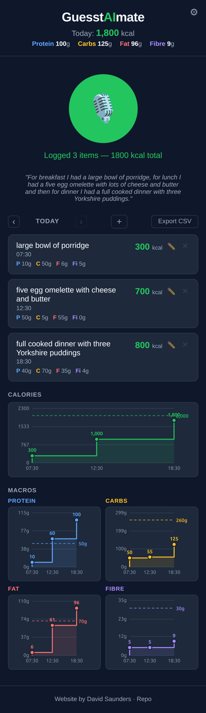

# GuesstAImate
> Speak what you ate. Get an instant calorie estimate. No forms, no faff.

**Try it live:** https://djsaunders1997.github.io/GuesstAImate

---

GuesstAImate is a voice-powered calorie tracker. Instead of searching a food database and weighing things, you just **speak one sentence** and it does the rest.

> *"I had scrambled eggs on toast and a coffee"* → instantly logged ✅

**A rough estimate you actually log beats a perfect one you don't.**

---

## Features

- 🎙️ **Voice logging** — tap record, say what you ate, done
- 🗣️ **Voice editing** — say *"Change my cornish pasty to 400 calories"* or *"Remove the biscuits"* to correct or delete existing entries
- ✏️ **Manual entry** — hit `+`, with autocomplete from previous entries
- 🍗 **Macros** — protein, carbs, fat and fibre alongside calories
- 📅 **Day-by-day history** — flick back through previous days
- 📈 **Charts** — see intake build up through the day, with target lines
- ⚙️ **Editable targets** — set your own daily calorie and macro goals
- 💬 **Live transcription** — words appear on screen as you speak
- 🔥 **Streak tracking** — consecutive logging days shown in the header
- 📱 **Installable** — add to home screen on Android or iPhone (PWA)
- 💾 **No account needed** — everything lives in your browser

---

## Tech Stack

| Layer | Technology | Hosting |
|---|---|---|
| Frontend | Vanilla JS + HTML5 Canvas | GitHub Pages |
| Backend | FastAPI (Python) | Azure Container Apps |
| Speech-to-Text | OpenAI Whisper-1 | OpenAI API |
| NLP / Macros | OpenAI GPT-4o-mini | OpenAI API |
| Storage | `localStorage` | Client-side |

For developer docs (file breakdown, PWA, local dev, deployment) → see [frontend/README.md](frontend/README.md).

---

## Potential Future Improvements

1. **User accounts + cloud sync** — log in to save your data across devices and not lose it if you clear your browser

   Two viable approaches:
   - **Firebase** (fastest) — Google's free-tier auth + Firestore database. No backend changes, talks directly from the browser. Handles thousands of users before hitting limits.
   - **Azure Table Storage + FastAPI** (most control) — add login endpoints and `GET /logs` / `POST /logs` to the existing backend. Table Storage is pennies per GB and fits the log data structure well.

   Either way, `localStorage` calls in `storage.js` would be replaced or mirrored with API/SDK calls, and the rest of the app stays the same.
2. **Barcode scanner** — point camera at a product barcode to auto-fill nutritional info without speaking
3. **Meal templates / favourites** — save a common meal (e.g. "my usual lunch") and log it in one tap
4. **Weekly & monthly summaries** — charts and averages across a broader time range, not just day-by-day
5. **Water intake logging** — track hydration alongside food, with a daily target
6. **Photo logging** — take a photo of your meal and let GPT Vision estimate the calories automatically
7. **Recipe builder** — enter ingredients to get a total macro breakdown for a homemade dish
8. **Barcode scanner** — point camera at a product barcode to auto-fill nutritional info without speaking
9. **Weekly & monthly summaries** — charts and averages across a broader time range, not just day-by-day
10. **Notifications / reminders** — push notifications to prompt logging at meal times (PWA supports this)
